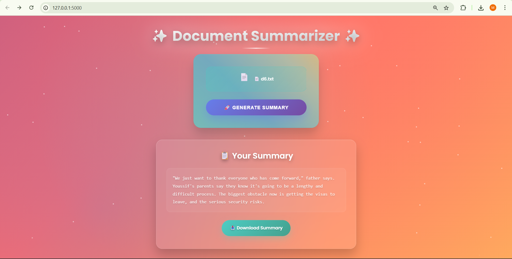

# 📄 Document Summarization using Retrieval-Augmented Generation (RAG)
Github: `https://github.com/ahmadsaeeduddin/DocumentSummarization_RAG`

Github: `https://github.com/ahmadsaeeduddin/DocumentSummarization_RAG`

Summarization system combines retrieval-based context selection with large language model (LLM) generation. The system accepts a long document and generate a concise, coherent summary using semantic chunking and RAG.

A complete RAG-based document summarizer that supports PDF, TXT, and MD formats using:
- Semantic chunking
- FAISS vector search
-  Hugging Face Transformers model named: `facebook/bart-large-cnn`
- Flask frontend for file upload and result viewing

---

## 🗂️ Project Structure

```
DOCUMENT-SUMMARIZATION(RAG)/
│
├── app/
│   ├── app.py                # Flask backend
│   ├── Backend/              # Optional backend utils
│   ├── static/
│   │   ├── script.js         # JavaScript functionality
│   │   └── styles.css        # Styling for frontend
│   ├── Summaries/            # Generated summaries (if saved)
│   └── index.html            # Upload and result UI
│
├── Data/                     # Input files uploaded used for testing
├── embedding/                # FAISS index and embeddings
├── env/                      # Environment-related files
├── .env                      
├── nltk-download.py          # For downloading NLTK 'punkt'
├── requirements.txt          # Python dependencies
├── README.md                 # This file
```

---

### 🔧 Requirements

- Python 3.8 or higher
- pip


## ⚙️ Setup Instructions

### 1. Clone the Repository

```bash
git clone https://github.com/ahmadsaeeduddin/DocumentSummarization_RAG
cd document-summarizer
```

### 2. Set Up Virtual Environment

```bash
python -m venv env
source env/Scripts/activate       # Windows: venv\Scripts\activate

if `source env/Scripts/activate` doesnot work use: './env/Scripts/activate'

```

### 3. Install Dependencies

```bash
pip install -r requirements.txt
```

### 4. Download NLTK Punkt (Run Once)

```bash
python nltk-download.py
```

### 5. Run the App

```bash
python app/app.py
```

`For Running first Tie it will download the Hugging Face Transformer Model in your cache`

Visit `http://localhost:5000` in your browser.

---

### ⚠️ Supported File Notes

- PDFs must be text-based (not scanned images).
- Markdown and TXT should be UTF-8 encoded.


## 🧪 Usage Guide

- Upload a `.pdf`, `.txt`, or `.md` document
- The system:
  1. Loads and chunks the document
  2. Embeds chunks via SentenceTransformers
  3. Uses FAISS to retrieve relevant parts
  4. Summarizes the result using `facebook/bart-large-cnn`
- Final summary is shown on screen

---


---

### 📝 Example

**Input Document:**

> LONDON, England (Reuters) -- Harry Potter star Daniel Radcliffe gains access to a reported £20 million ($41.1 million) fortune as he turns 18 on Monday, but he insists the money won't cast a spell on him. Daniel Radcliffe as Harry Potter in "Harry Potter and the Order of the Phoenix" To the disappointment of gossip columnists around the world, the young actor says he has no plans to fritter his cash away on fast cars, drink and celebrity parties. "I don't plan to be one of those people who, as soon as they turn 18, suddenly buy themselves a massive sports car collection or something similar," he told an Australian interviewer earlier this month. "I don't think I'll be particularly extravagant. "The things I like buying are things that cost about 10 pounds -- books and CDs and DVDs." At 18, Radcliffe will be able to gamble in a casino, buy a drink in a pub or see the horror film "Hostel: Part II," currently six places below his number one movie on the UK box office chart. Details of how he'll mark his landmark birthday are under wraps. His agent and publicist had no comment on his plans. "I'll definitely have some sort of party," he said in an interview. "Hopefully none of you will be reading about it." Radcliffe's earnings from the first five Potter films have been held in a trust fund which he has not been able to touch. Despite his growing fame and riches, the actor says he is keeping his feet firmly on the ground. "People are always looking to say 'kid star goes off the rails,'" he told reporters last month. "But I try very hard not to go that way because it would be too easy for them." His latest outing as the boy wizard in "Harry Potter and the Order of the Phoenix" is breaking records on both sides of the Atlantic and he will reprise the role in the last two films. Watch I-Reporter give her review of Potter's latest » . There is life beyond Potter, however. The Londoner has filmed a TV movie called "My Boy Jack," about author Rudyard Kipling and his son, due for release later this year. He will also appear in "December Boys," an Australian film about four boys who escape an orphanage. Earlier this year, he made his stage debut playing a tortured teenager in Peter Shaffer's "Equus." Meanwhile, he is braced for even closer media scrutiny now that he's legally an adult: "I just think I'm going to be more sort of fair game," he told Reuters. E-mail to a friend . Copyright 2007 Reuters. All rights reserved.This material may not be published, broadcast, rewritten, or redistributed.

**Generated Summary:**

> Harry Potter star Daniel Radcliffe turns 18 on Monday. He gains access to a reported £20 million ($41.1 million) fortune. Radcliffe's earnings from the first five Potter films have been held in a trust fund. The Londoner has filmed a TV movie called "My Boy Jack"


---

## ❗ Troubleshooting

| Problem | Solution |
|--------|----------|
| `nltk.punkt not found` | Run `python nltk-download.py` |
| `No module found <>` | Make Sure you activated the Virtual Environment `env` |
| Flask not starting | Ensure `app.py` is run from inside the `/app` directory |
| No summary output | Check if FAISS index was created and query was valid |

---

## 📌 Notes

- The app is modular. You can reuse `main.py` or split the backend from the Flask frontend easily.
⚠️ On first run, the Hugging Face model `facebook/bart-large-cnn` will be downloaded (~1.5GB). Ensure internet connection and space.

---

## 🧠 Credits

- FAISS by Facebook AI
- SentenceTransformers by UKPLab
- facebook-bart-large-cnn

## 📷 Preview


